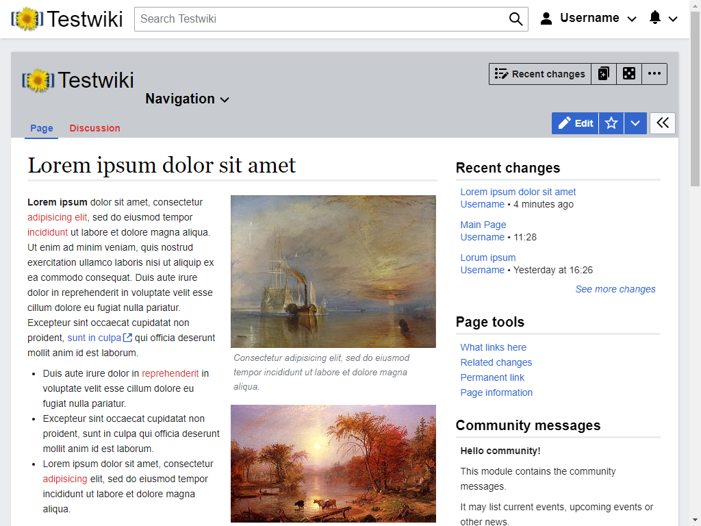
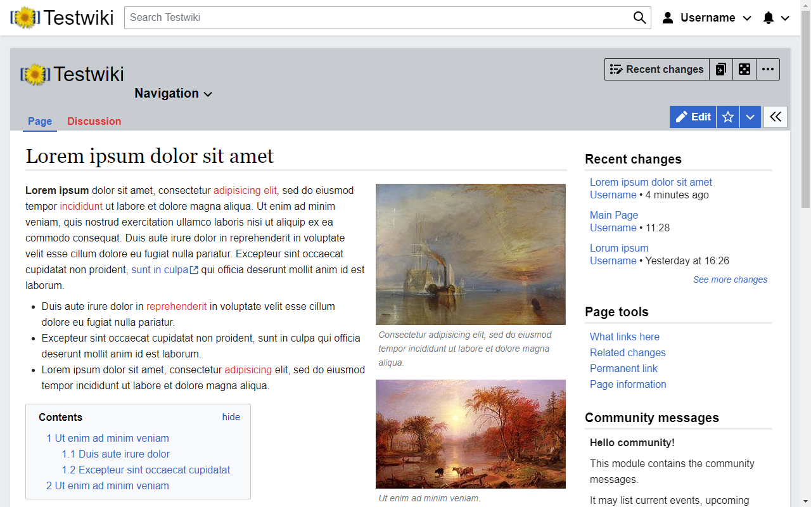
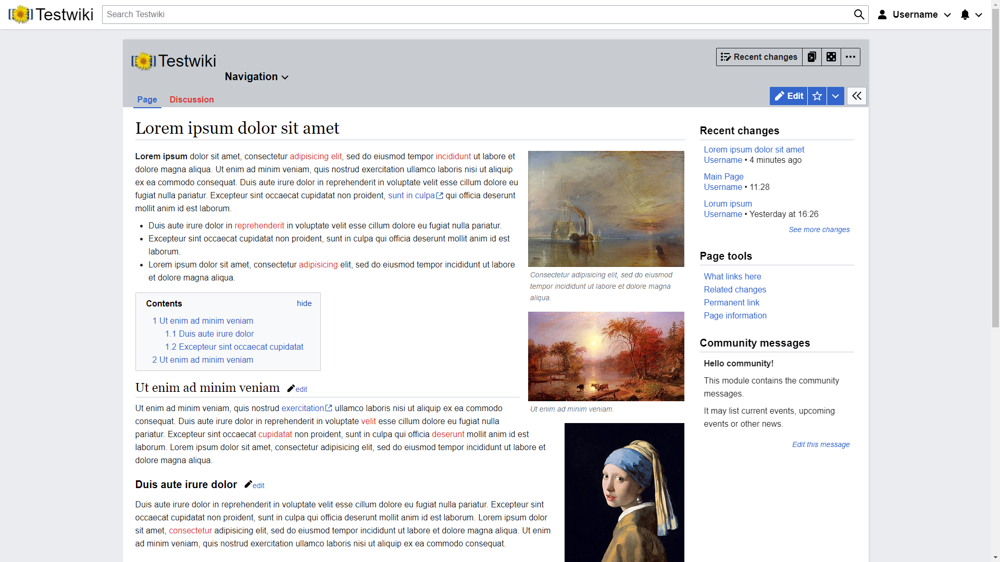
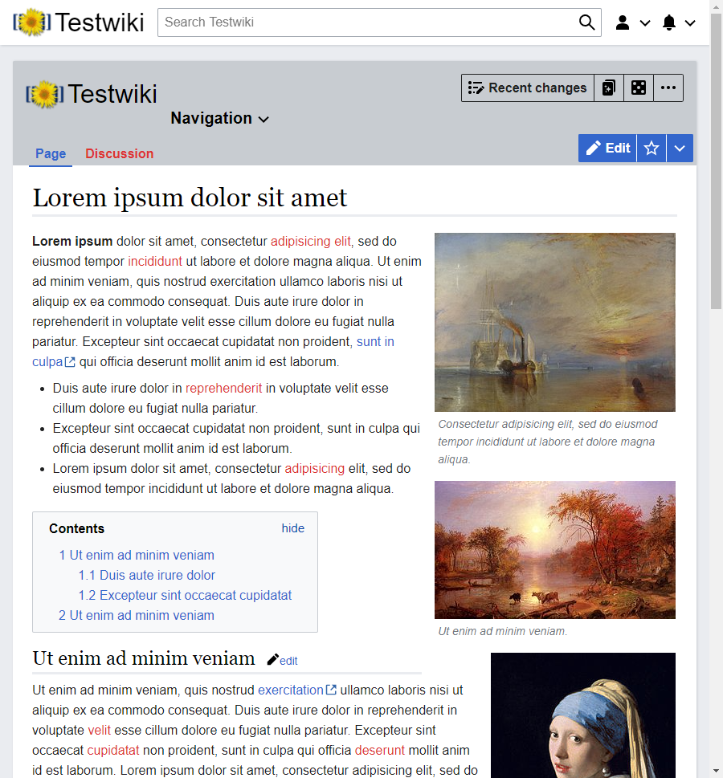

# Mirage
Mirage is a responsive skin that focuses on displaying content with a rail on the right.

## About the name
Mirage is based on Oasis, the skin used by [FANDOM](https://www.fandom.com). Rather than be an exact copy of the Oasis skin, Mirage is a reflection of Oasis' appearance; a mirage of an oasis.

## Features
Mirage supports on-wiki configuration for several of its features.
### Wordmark
Mirage will use the wordmark from `mirage-wordmark.png` when that file exists and
`$wgMirageEnableWordmark` is enabled.
The file should be 250 pixels wide and 65 pixels high.

### Navigation
Mirage can use navigation defined in `MediaWiki:sidebar`, but also supports enhanced navigation
through the `MediaWiki:mirage-navigation` message. It uses the same syntax as
`MediaWiki:sidebar` does, but with support for nesting, allowing each navigation dropdown to
have a submenu.

### Community messages
Community messages is a right rail module that displays the content of
`MediaWiki:mirage-community-messages`. It only shows if that message is not disabled.

### Avatars
Mirage supports user avatars through two extensions: [SocialProfile](https://www.mediawiki.org/wiki/Extension:SocialProfile) and [MW-Avatar](https://github.com/nbdd0121/MW-Avatar).

## Themes
Mirage supports the [Theme extension](https://www.mediawiki.org/wiki/Extension:Theme) out of the box.
Additionally, if the Theme extension isn't installed, setting `$wgMirageTheme` to any of the
supported themes listed below, allows enabling the theme manually. This is currently the only way Mirage can provide a dark mode.

### DarkMirage
A dark mode.

### Neutral
Mirage, but without some of the more controversial WikimediaUI elements.

## Examples
#### Desktop: 1024 by 768

#### Desktop: 1280 by 800

#### Desktop: 192 by 1080

#### Mobile: 700 by 969

#### Mobile: 900 by 969


## Configuration
### `$wgMirageEnableWordmark`
This setting controls if the file `mirage-wordmark.png` should be used as the wordmark. When
enabled, users can change the wordmark by uploading a new version of that file.
The file should be 250 pixels wide and 65 pixels high.

This file should be protected against re-uploads to prevent changes to the wordmark without the proper permissions.

If the file does not exist, or if this setting is disabled, a wordmark will be created from the
value of `$wgLogos`.

### `$wgMirageTheme`
This setting controls the default theme of Mirage, when the [Theme extension](https://www.mediawiki.org/wiki/Extension:Theme) isn't installed.
Currently, Mirage supports the `neutral` and `darkmirage` themes.

### `$wgMirageForceTemplateRecompilation`
This setting is for development use and disables the caching of the Mustache templates that make
up Mirage.

### `$wgMirageHiddenRightRailModules`
This setting contains a list of right rail modules that should not be shown. The list consists
of module names. Mirage supports the following right rail modules out of the box:
 - RecentChanges - An overview of the last four changes to pages in content namespaces
 - PageToolsModule - Toolbox tools for the current page
 - UserToolsModule - Toolbox tools for the current user
 - Categories - Categories for the current page
 - LanguageLinksModule - Language links for the current page
 - CommunityMessages - The contents of `MediaWiki:mirage-community-messages`
 - ... - Other sidebar modules added by extensions

### `$wgMirageRightRailVisibleToAnonByDefault`
This setting affects the initial visibility of the right rail for anonymous users. By default, the right rail is not visible.

## I don't like the ...
Mirage as a few design and layout decisions that are controversial to some more experienced users.
This section describes how to undo those.

### Limited content width
By default, Mirage limits the content width on all pages, except special pages and page history.
This can be controlled through a user preference, that allows you to choose between no limit,
limit all pages except special pages and page history or limit all pages.

### Wikimedia Design Style Guide stylings
Mirage comes with the [Neutral](#Neutral) theme, which disables the more controversial parts. It
can be enabled through `$wgMirageTheme`, or, when the [Theme extension](https://www.mediawiki.org/wiki/Extension:Theme)
is installed, by choosing the Neutral theme.

### Change in font size between mobile and wide screen
Mirage uses the default browser font size in both mobile and wide screen mode. Normally, this
results in text being 16 pixels tall. Most other skins (notably excluding Minerva, the mobile
skin) use a 14 pixel font size instead. If you prefer this, you can add
```css
.skin-mirage {
	font-size: 0.875rem
}
```
to your user css, which will force a font size of 14 pixels.
